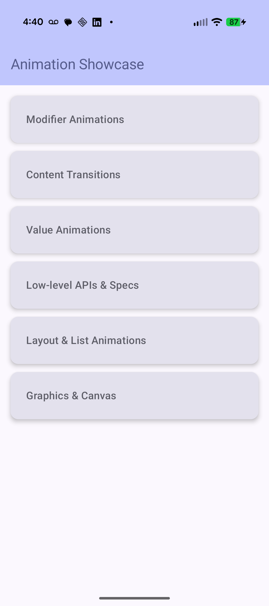

# Android Animation One-Stop Shop

A comprehensive showcase of Jetpack Compose animation APIs, organized into logical categories for easy exploration and learning. This project demonstrates everything from basic property animations to complex shared element transitions and physics-based motion.

## 📱 Animation Categories

### 1. Modifier Animations
Focuses on animations that are applied directly as `Modifier`s to composables.
- **`animateContentSize()`**: Automatically animates a layout's size when its children change.
- **`animateBounds()`**: A modern (Compose 1.8+) API for animating a composable's size and position within a `LookaheadScope`.
- **`graphicsLayer`**: Used for performant 2D/3D transformations like rotation (Z and Y for flips), scale, and alpha (transparency).
- **`AnimatedVisibility`**: The standard way to animate the appearance and disappearance of content.
- **Gesture-based Motion**: Using `Modifier.draggable` combined with `Animatable` for interactive, physics-driven components (like a snap-back box).

### 2. Content Transitions
Covers transitions between different pieces of content or entire screens.
- **Shared Element Transitions**: Using `SharedTransitionLayout` to morph elements (images, shapes) across different UI states.
- **AnimatedContent**: A high-level API for animating transitions between different states/composables with custom `ContentTransform`s.
- **Crossfade**: A simple transition for fading between two pieces of content.
- **Reveal Transitions**: Using `skipToLookaheadPosition()` to keep new content pinned during container expansion.
- **Velocity Handoff**: Using `prepareTransitionWithInitialVelocity` to maintain gesture momentum during a transition (Compose 1.10+).
- **Veil/Scrim Effects**: Experimental `unveilIn` and `veilOut` transitions for fading color overlays over content.

### 3. Value Animations
The "bread and butter" of Compose animations, using `animate*AsState` for various data types.
- **`animateDpAsState`**: Elevation, padding, offsets, and dimensions.
- **`animateFloatAsState`**: Alpha, rotation, scale, and progress values.
- **`animateColorAsState`**: Smooth color morphing.
- **`animateIntAsState`**: Number counters and text-based animations.
- **`animateOffsetAsState` / `animateIntOffsetAsState`**: 2D coordinate positioning.
- **`animateSizeAsState` / `animateIntSizeAsState`**: Box dimensions.
- **`animateRectAsState`**: Full bounding box animations.

### 4. Low-level APIs & Specs
The underlying building blocks and customization options for motion.
- **`Animatable`**: Low-level control for manual animation management (e.g., launching animations in a coroutine).
- **`updateTransition`**: Coordinates multiple animations across different properties simultaneously based on a state change.
- **`InfiniteTransition`**: For repeating, loop-based animations like pulsing or rotating loaders.
- **`animateDecay`**: Physics-based animations where motion slows down naturally based on initial velocity (flings).
- **AnimationSpec Comparison**: Visual demos of `tween()`, `spring()`, and `keyframes()`.

### 5. Layout & List Animations
Animations specifically designed for collection-based layouts.
- **`Modifier.animateItem()`**: The modern way (Compose 1.7+) to animate item additions, removals, and reordering in a `LazyColumn` or `LazyRow`.

### 6. Graphics & Canvas
Directly animating drawing commands.
- **Canvas Animations**: Driving custom shapes and transformations inside a `DrawScope` using state-based values for precise graphical control.

## Screenshots

  
  

